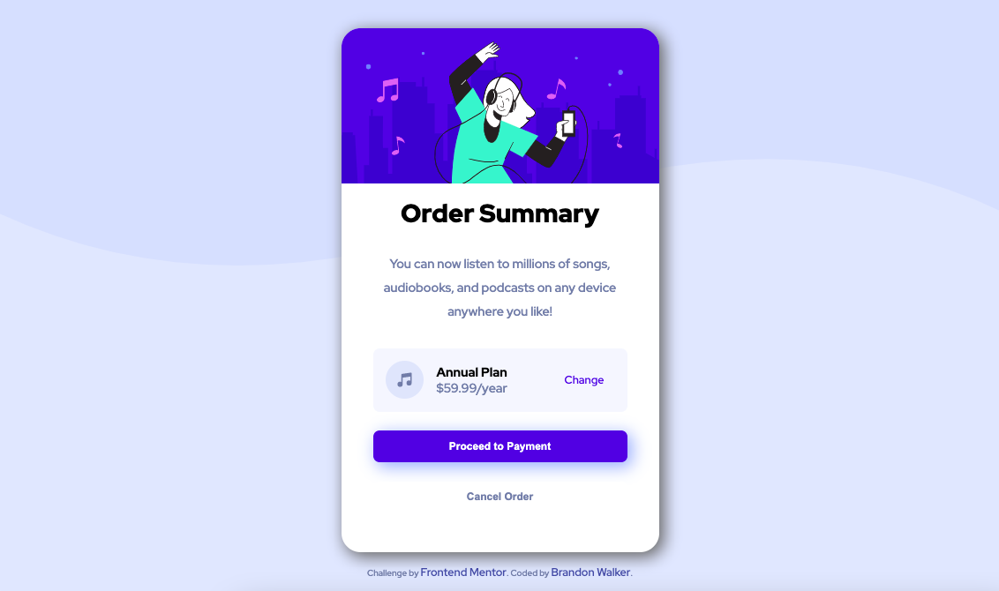

# Frontend Mentor - Order summary card solution

This is a solution to the [Order summary card challenge on Frontend Mentor](https://www.frontendmentor.io/challenges/order-summary-component-QlPmajDUj). Frontend Mentor challenges help you improve your coding skills by building realistic projects. 

## Table of contents

- [Overview](#overview)
  - [The challenge](#the-challenge)
  - [Screenshot](#screenshot)
  - [Links](#links)
- [My process](#my-process)
  - [Built with](#built-with)
  - [What I learned](#what-i-learned)
  - [Continued development](#continued-development)
  - [Useful resources](#useful-resources)
- [Author](#author)
- [Acknowledgments](#acknowledgments)

## Overview

### The challenge

Users should be able to:

- View the optimal layout depending on their device's screen size
- See hover states for interactive elements

### Screenshot

### Links

- Solution URL: [Add solution URL here](https://your-solution-url.com)
- Live Site URL: [GitHub Pages]()

## My process

### Built with

- HTML5
- CSS

### What I learned

This is my second Frontend Mentor project. I used the :hover pseudo class which was new to me from the NFT card challenge. On the first challenge I tried on Frontend Mentor, I was unaware of using this pseudoclass. Additionally, I used the hsl color value to produce the changes in color for the hover state. 

Also, the use of the background-image property was new to me. It took several attempts for me to position and size this properly.

### Continued development

I still have a limited working knowledge of CSS and HTML. I plan to continue working on the Frontend Mentor challenges in the "Newbie" difficulty to improve my layout skills.

### Useful resources

- https://css-tricks.com/snippets/css/complete-guide-grid/ 
- https://developer.mozilla.org/en-US/docs/Web/CSS/position 

## Author

- Website - [Brandon Walker] - Web Site Not Created Yet
- Frontend Mentor - [@walker861](https://www.frontendmentor.io/profile/walker861)
- Twitter - [@bwalkerDPT](https://www.twitter.com/bwalkerDPT)

## Acknowledgments

Thanks to Frontend Mentor for posting these challenges. They are very helpful for implementing concepts I am learning through various free resources.

